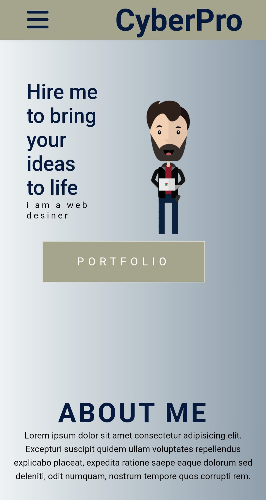

# My-Portfolio
My first portfolio, a website that was built to know better the css and html world.
Built on the third week of my boocamp course that ive did.

## Table Of Contents
- [My-portfolio](#My-portfolio)

  * [Running the project](#running-the-project)
  * [Screenshots](#screenshots)
  * [Technologies](#technologies)
    + [Client-Side](#client-side)
  

## Running the project

1. Clone the repo.
2. Click go-live (on live server feature)

## Screenshots

### Home

## Technologies:

### Client-side:
* HTML5
* CSS

